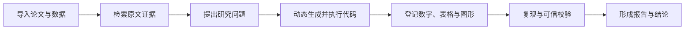
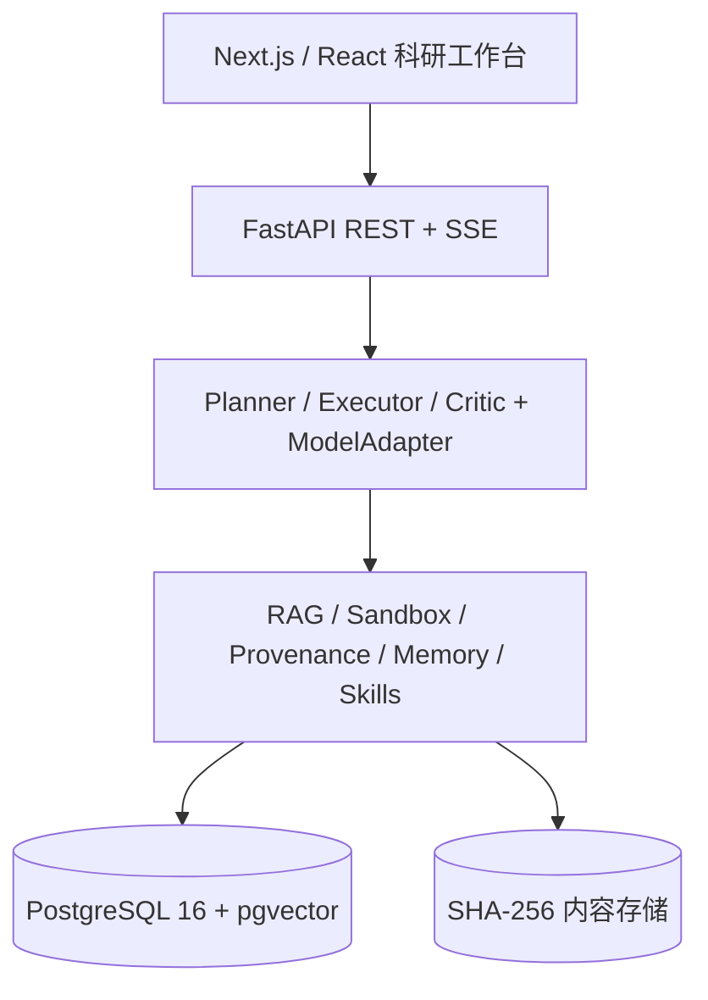

<h1 align="center">ReproLab</h1>

<p align="center">
  <strong>让科研 AI 的每个数字都有来路，每个结论都能重跑。</strong>
</p>

<p align="center">
  面向研究生的本地优先科研工作台，将资料检索、动态分析、成果写作与可复现溯源连接成一条可信研究链。
</p>

<p align="center">
  <a href="https://github.com/telawang91-dotcom/reprolab/actions/workflows/quality.yml"></a>
  
  
  
  
</p>


ReproLab 不只是给科研流程增加一个聊天界面。它把“证据是否支持结论、数字能否重新计算、数据变化后结果是否仍成立”变成系统必须执行的检查。

> **可信由数据链路和验证机制保证，而不是由某个具体模型保证。**

## 快速导航

- [为什么是 ReproLab](#为什么是-reprolab)
- [可信研究闭环](#可信研究闭环)
- [五分钟启动](#五分钟启动)
- [核心能力](#核心能力)
- [技术设计](#技术设计)
- [开发与验证](#开发与验证)
- [文档地图](#文档地图)
- [安全边界](#安全边界)

## 为什么是 ReproLab

传统科研 AI 往往只交付一段答案或一张图，ReproLab 交付的是可以审计、复现和继续演化的研究证据。

| 常见科研 AI | ReproLab |
| --- | --- |
| 返回看似合理的答案 | 引用可定位到原文证据片段 |
| 图表生成后输入、代码与环境容易丢失 | 每个成果绑定 Dataset → Run → Artifact 完整血缘 |
| 无来源内容先进入报告，最后才人工排查 | 来源不完整时直接拦截保存、复用和发布 |
| 数据更新后依赖人工逐项复核 | 一键重跑、容差比较、漂移标红与差异归因 |
| 错误只提示“请重试” | 数字、引用、图表三查，并支持反思式修复 |
| 跨任务记忆来源模糊 | 记忆按项目隔离，召回前检查来源和适用范围 |

适合复现论文结果、自然语言数据分析、回答导师追问、数据更新复核、投稿前质量检查，以及长期研究项目管理。

## 可信研究闭环



每一步都会留下可持久化记录。用户可以从报告中的数字或图表，反向定位到成果、运行代码、环境快照和原始数据。

正文使用机器可解析锚点逐项对账：

- 数字与成果：`⟦art_xxxx⟧`
- 文献与原文：`⟦src_xxxx⟧`

任何进入结论的数字都必须具备完整链路：

```text
Dataset ──reads──▶ Run ──produces──▶ Artifact ──supports──▶ Claim
                                                   ▲
Document ──────────────────────── cites ────────────┘
```

## 五分钟启动

推荐使用 Docker Desktop。仓库已封装应用构建、数据库迁移和健康检查；宿主机无需单独安装 Python、Node.js 或 PostgreSQL。

```powershell
git clone https://github.com/telawang91-dotcom/reprolab.git
Set-Location reprolab

# 检查 Docker 与端口状态
.\scripts\reprolab.ps1 doctor

# 创建本地 .env、构建镜像、迁移数据库并等待健康
.\scripts\reprolab.ps1 start
```

启动完成后：

| 入口 | 地址 | 用途 |
| --- | --- | --- |
| 科研工作台 | <http://localhost:3000> | 项目、资料、分析与成果入口 |
| 首次演示 | <http://localhost:3000/demo> | 创建与真实研究空间隔离的示例项目 |
| API 文档 | <http://localhost:8000/docs> | 查看并试调 REST / SSE 接口 |
| 健康检查 | <http://localhost:8000/health> | 服务状态与部署探针 |

没有模型密钥也可以管理资料、查看结构化数据、既有成果、溯源和复现报告；配置模型后启用 Agent 分析、语义检索增强和模型校验。

常用运维命令：

```powershell
.\scripts\reprolab.ps1 status
.\scripts\reprolab.ps1 logs
.\scripts\reprolab.ps1 stop
```

首次使用建议打开 `/demo`，按“添加资料 → 运行分析 → 检查成果 → 形成报告”的路径体验真实闭环。完整安装、端口调整和故障恢复见[启动与运行手册](docs/12-RUNBOOK.md)。

## 核心能力

| 能力 | 当前实现 | 产品入口 |
| --- | --- | --- |
| 多源资料管理 | PDF、CSV、XLSX、Markdown、TXT、Python、Notebook 与文件夹统一入库 | `/knowledge` |
| 混合 RAG | 元数据预过滤、BM25、pgvector、RRF 融合、交叉编码重排、原文锚点 | `/knowledge` |
| 动态数据分析 | Planner / Executor / Critic 根据真实字段动态生成并执行 Python | `/analysis` |
| 可信成果 | 数字、表格和图绑定数据、代码、环境与执行记录 | `/results` |
| 复现与漂移 | 固定随机种子重跑、数值容差比较、图形数据比较、差异归因 | `/lineage` |
| 写作与校验 | 数字、引用、图表三查；通过后才能发布可信结论 | `/results` |
| 长期记忆 | 项目隔离的情节、语义与技能记忆，召回前核验 | `/memory` |
| 平台调用 | REST、SSE 与无界面 Agent 入口，核心能力不依赖前端 | `/docs` |

### 资料到分析

- 任意文件、完整文件夹和 ZIP 可直接入库；暂不可解析的格式保留原文件并明确标记状态。
- 研究项目隔离全部资料和历史，研究文件夹限定当前 Agent 可访问的范围。
- Agent 根据用户问题和真实数据动态规划分析，不依赖固定学科菜单。
- 页面流式展示计划、代码、运行状态、产物、所用资料与可恢复错误。


### 成果到报告

- 只有用户主动保存且来源完整的成果才能进入成果库和报告。
- 点击任意成果可查看 Dataset → Run → Artifact 血缘并执行复现。
- 数据变化后按数值容差或绘图底层数据判断漂移，不比较 PNG 字节。
- 写作区逐项核对 `⟦art_*⟧` 与 `⟦src_*⟧`，失败内容可定位和修复。
- 删除对话或移出成果库不会破坏已经登记的运行与溯源账本。


## 技术设计

### 信任锚点

```text
env_hash   = SHA256(Python 版本 + 依赖包版本)
input_hash = SHA256(所有输入数据内容哈希)
code_hash  = SHA256(代码 + 语言 + input_hash + env_hash)
```

代码、输入或环境任一变化，信任锚点都会变化。数据和文件产物按内容寻址保存到 `backend/storage/<sha256>`。

### 复现与质检

- **数值 / 表格**：按容差比较，而不是机械比较字符串。
- **图形**：比较绘图底层结构化数据和语义指纹，而不是 PNG 字节哈希。
- **文件**：使用内容哈希比较。
- **漂移归因**：通过受控消融和逐项回放定位变化来源。
- **引用 NLI**：区分证据对论断的支持、中立与矛盾。
- **Reflexion Repair**：将校验失败反馈给写作或执行 Agent，多轮修正后重新验证。

### 系统架构



| 层 | 技术 |
| --- | --- |
| 前端 | Next.js 14、React 18、TypeScript 5.4、Tailwind CSS、React Flow |
| 后端 | Python 3.11、FastAPI、Pydantic 2、SQLAlchemy 2、Alembic |
| 数据 | PostgreSQL 16、pgvector 0.7、本地 SHA-256 内容存储 |
| 检索 | bge-m3、BM25、RRF、bge-reranker-v2-m3 |
| 执行 | 持久 Jupyter kernel、Docker Python 3.11 科学计算环境 |
| Agent | 轻量 Planner / Executor / Critic 编排、模型无关 ModelAdapter |

业务层只通过统一的 `ModelAdapter.chat(...)` 调用模型。当前支持 DeepSeek、腾讯混元和其他 OpenAI 兼容服务；切换模型不会改变溯源、执行与校验规则。

## 配置模型

可以在产品设置页配置模型，也可以编辑本地 `.env`：

```env
LLM_MODEL=deepseek-v4-flash
DEEPSEEK_BASE_URL=https://api.deepseek.com
DEEPSEEK_API_KEY=

PLANNER_MODEL=deepseek:deepseek-v4-flash
EXECUTOR_MODEL=deepseek:deepseek-v4-flash
CRITIC_MODEL=deepseek:deepseek-v4-pro
```

Embedding 默认为 `BAAI/bge-m3`，重排模型默认为 `BAAI/bge-reranker-v2-m3`。离线环境可将模型变量指向本地绝对路径或 `.models/` 中的缓存。

> 不要提交 `.env`、API Key、研究数据、备份或模型文件。

完整变量说明见 [.env.example](.env.example)。对外开放无界面 Agent API 时必须配置 `AGENT_API_TOKEN`。

## 开发与验证

### 本地开发

Docker 只运行 PostgreSQL，后端和前端分别热更新：

```powershell
py -3.11 -m venv .venv
.\.venv\Scripts\python.exe -m pip install -r backend\requirements.txt
npm.cmd --prefix frontend install
if (-not (Test-Path .env)) { Copy-Item .env.example .env }

docker compose up -d postgres
.\scripts\start_api.ps1 -SandboxBackend host
```

在另一个终端启动前端：

```powershell
npm.cmd --prefix frontend run dev
```

### 质量门禁

一键执行仓库卫生、后端测试、前端契约测试、类型检查、生产构建和 Playwright 产品流程：

```powershell
powershell.exe -NoProfile -ExecutionPolicy Bypass `
  -File .\scripts\verify_product.ps1 `
  -Python "$PWD\.venv\Scripts\python.exe"
```

文档或仓库结构变更至少运行：

```powershell
.\.venv\Scripts\python.exe .\scripts\check_repository_hygiene.py
git diff --check
```

GitHub Actions 会在 push 和 Pull Request 时执行质量门禁与可信核心集成测试。完整 P0 验收、隔离评测、备份和恢复流程见[运行手册](docs/12-RUNBOOK.md)与[本地目录边界](docs/11-LOCAL-WORKSPACE.md)。

## API 与集成

所有业务接口使用 `/api/v1` 前缀，Swagger 位于 <http://localhost:8000/docs>。核心能力均通过 REST / SSE 暴露，可脱离前端调用。

```text
POST /api/v1/search                 混合检索
POST /api/v1/chat                   流式分析会话
POST /api/v1/runs                   执行代码并登记血缘
GET  /api/v1/artifacts/{id}/lineage 查看溯源 DAG
POST /api/v1/runs/{id}/reproduce    重跑与漂移比较
POST /api/v1/verify                 数字、引用、图表校验
POST /api/v1/agent/invoke           无界面 Agent 调用
```

完整契约见 [REST API](docs/04-API.md) 和 [Agent REST 调用](docs/09-AGENT-API.md)。

## 项目结构

```text
reprolab/
├─ backend/             FastAPI、服务层、迁移、测试与内容存储
├─ frontend/            Next.js 页面、组件、API 客户端与端到端测试
├─ benchmarks/          检索样例、烟雾数据与产品评测基线
├─ docker/              应用和科学计算沙箱镜像
├─ docs/                产品、架构、契约、设计与运维文档
├─ tasks/               分模块任务卡与验收标准
├─ scripts/             启停、验证、评测、备份和交付脚本
└─ docker-compose.yml   应用、PostgreSQL / pgvector 与沙箱配置
```

## 文档地图

| 想了解什么 | 文档 |
| --- | --- |
| 产品范围与用户价值 | [产品需求](docs/01-PRD.md) |
| 分层架构与技术选型 | [技术架构](docs/02-ARCHITECTURE.md) |
| 表结构与约束 | [数据模型](docs/03-DATA-MODEL.md) |
| REST / SSE 契约 | [REST API](docs/04-API.md) |
| 溯源、复现与校验 | [可信机制](docs/05-PROVENANCE.md) |
| 页面与设计令牌 | [UI / UX 规范](docs/06-DESIGN.md) |
| 评分对齐与算法亮点 | [评审与技术深度](docs/07-SCORING.md) |
| Agent 角色与编排 | [智能体设计](docs/08-AGENT-DESIGN.md) |
| 无界面 Agent 接入 | [Agent REST 调用](docs/09-AGENT-API.md) |
| Docker 构建与交付 | [Docker 交付](docs/10-DOCKER-DELIVERY.md) |
| 本地文件与缓存边界 | [本地工作区](docs/11-LOCAL-WORKSPACE.md) |
| 启动、停止与故障恢复 | [运行手册](docs/12-RUNBOOK.md) |
| 版本变化与已知风险 | [CHANGELOG](CHANGELOG.md) · [SECURITY](SECURITY.md) |

开发前请阅读 [AGENTS.md](AGENTS.md) 和对应的 `tasks/` 任务卡。数据表、接口、可信机制和 UI 的唯一事实来源分别是 `docs/03-DATA-MODEL.md`、`docs/04-API.md`、`docs/05-PROVENANCE.md` 与 `docs/06-DESIGN.md`。

## 安全边界

ReproLab 当前定位为本地优先的单机科研工作台、科研工作流 Demo、比赛展示和内部 Beta：

- PostgreSQL、内容存储、模型缓存和运行日志默认保存在本机目录或 Docker 卷。
- 使用远程模型时，任务所需提示、字段和证据片段会发送到所配置的模型服务。
- Docker 沙箱适合本机和受信任使用者，不应直接作为公网多租户代码执行环境。
- 项目隔离是应用层数据作用域，不等同于独立租户或操作系统安全边界。
- 日常停止使用 `.\scripts\reprolab.ps1 stop`；`docker compose down -v` 会删除数据卷。

面向公开多用户生产环境前，仍需补充身份认证、细粒度授权、独立执行节点、网络出口限制、持久任务队列、集中审计和并发压测。更多说明见 [SECURITY.md](SECURITY.md)。

---

<p align="center">
  <strong>ReproLab：让研究结果不只“看起来正确”，还能够被追溯、被重跑、被验证。</strong>
</p>
