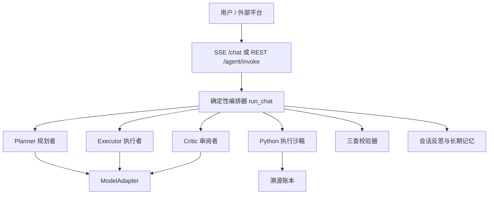
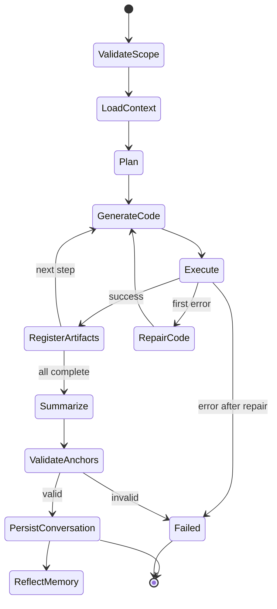

# 08・智能体详细设计

本文描述 ReproLab 当前已经实现的智能体系统，作为 Agent 编排、模型路由、代码执行、可信校验和外部平台调用的设计依据。

目标不是构造一个不受约束的“万能科研 Agent”，而是在确定性业务外壳内使用模型完成适合模型的判断任务，并将数据读取、代码执行、产物登记、溯源和校验交给可审计程序。

> 核心原则：模型负责规划、生成和解释；架构负责权限、执行、证据、血缘与可信门禁。

## 1. 设计目标

### 1.1 功能目标

1. 用户用自然语言描述跨学科数据分析任务；
2. 规划者将任务拆成少量可执行步骤；
3. 执行者根据真实数据结构动态生成 Python；
4. 代码在固定种子、超时和隔离环境中执行；
5. 数字、表格和图形必须登记为 Artifact；
6. 审阅者只能依据真实工具结果生成带锚点结论；
7. 校验器检查引用、数字和图码一致性；
8. 会话结束后提取项目级长期记忆；
9. 同一内核既支持 Web SSE，也支持无头 REST 调用。

### 1.2 非功能目标

- 可审计：计划、代码、运行、产物和消息均可持久化；
- 可复现：记录输入哈希、代码哈希、环境快照和随机种子；
- 可替换：业务编排不直接依赖具体模型厂商；
- 可控制：模型不直接访问数据库、文件系统、网络或执行器；
- 可恢复：代码执行失败后允许有限次数的基于报错修复；
- 可隔离：所有会话、数据集、技能、记忆和产物受 `project_id` 约束；
- 可流式：前端按真实状态逐步渲染，而不是等待最终长文本。

## 2. 总体架构



| 层 | 组件 | 责任 |
| --- | --- | --- |
| 入口层 | `/chat`、`/agent/invoke` | 输入校验、SSE 或结构化响应 |
| 编排层 | `orchestrator.run_chat`、`runtime.run_agent` | 状态推进、角色调用、有限重试 |
| 模型层 | `ModelAdapter` | 模型路由、协议归一、工具调用、重试和 usage |
| 执行层 | sandbox runner、Jupyter/Docker | 运行代码、固定种子、捕获标准输出与产物 |
| 可信层 | ledger、verifier、reflexion | 血缘、复现、三查、自修复与记忆 |

## 3. 智能体角色

### 3.1 Planner：科研分析规划者

输入包括当前请求、会话历史、数据集名称与 schema、已核验长期记忆和可选技能包。输出严格为 JSON：

```json
{"steps":[{"title":"检查数据","rationale":"确认字段和缺失值"},{"title":"执行分析","rationale":"计算统计量并生成图表"}]}
```

约束：只允许 1–3 步；不直接生成结论或执行工具；计划必须基于当前数据结构；技能包只是可选加速模板，不能成为固定学科菜单。

### 3.2 Executor：通用科研分析执行者

输入包括用户请求、当前步骤、数据 schema、记忆、技能模板以及上次完整执行报错。输出为纯 Python 代码。

执行约束：

- 数据路径只能使用 `DATASET_PATHS[index]`；
- 不得硬编码本机路径、联网或安装依赖；
- 使用预装的 pandas、NumPy、SciPy、statsmodels、scikit-learn、matplotlib；
- 重要标量、系数和表格必须调用 `emit_artifact(kind, value, title, tol)`；
- 图形调用 `plt.show()`，并优先保存结构化绘图数据；
- 不得伪造未执行的结果。

### 3.3 Critic：科研分析审阅者

Critic 只接收用户请求、真实 stdout、已登记 Artifact 锚点和步骤摘要，并输出 Markdown 结论。

强制规则：不得使用工具结果之外的数字；所有数字必须紧跟 `⟦art_*⟧`；存在 Artifact 时至少引用一个真实锚点。若返回文本没有有效锚点，编排器直接失败。

### 3.4 Verifier：对抗式校验器

Verifier 是可信门禁，由确定性检查和局部模型判断组成：

| 检查 | 确定性部分 | 模型部分 |
| --- | --- | --- |
| 引用核查 | 项目内文献存在性、短码唯一性、DOI 格式 | NLI 判断文献是否支持论断 |
| 数字核查 | 锚点、Artifact 类型、成功 Run、完整血缘、数值容差 | 无 |
| 图码一致 | 找到图形 Run、重新执行、比较结构化绘图数据 | 无 |

统一输出：

```json
{"check":"number","target_anchor":"⟦art_ab12⟧","verdict":"fail","severity":"error","reason":"正文数字与产物值不符","locate":"正文上下文"}
```

### 3.5 Reflection Repair：反思式修复

修复循环默认最多 2 次。当前允许：用真实 Artifact 值替换错误数字；在当前项目检索引用候选；仅当 NLI 达标且短码唯一时替换引用；找不到证据则删除不支持引用或保留标红；保存每轮失败项和修复动作。

禁止凭空构造数据、修改原始数据迎合结论、绕过血缘、无限循环或在没有证据时生成引用。

## 4. 主编排状态机



### 4.1 上下文装配

1. 校验或创建 Conversation；
2. 复用会话时验证 `project_id`；
3. 按时间读取 Message 历史；
4. 校验 Dataset 并读取名称与 schema，不把完整数据直接塞入提示；
5. 每一轮都按当前问题在项目内召回长期记忆，并过滤超过 180 天或重要度低于 0.2 的记录；
6. 校验技能属于全局内置或当前项目；
7. 将数据范围、`memory.search` 和记忆命中、技能选择保存为可回放的工具回执；
8. 保存用户消息后进入规划。

### 4.2 步骤执行与代码修复

```text
生成代码 → 执行
  ├─ success → 登记产物 → 下一步骤
  └─ error   → 将完整 stdout 交给 Executor 修复一次
                  ├─ success → 继续
                  └─ error   → 分析失败
```

Agent 编排调用沙箱时设置 `max_retries=0`，避免用相同错误代码盲目重跑；第二次尝试必须由 Executor 根据报错生成新代码。

### 4.3 最终结论

全部步骤成功后，Critic 基于真实 `tool_summaries` 生成结论；每个摘要项显式包含步骤内 Artifact 的标题、账本值与锚点，不只提供 stdout。只有本次运行实际产生且确实出现在文本中的锚点才进入 `citations`。Critic 文本在保存前强制执行 `check_numbers`：裸数字、锚点不存在、血缘不完整或正文值与 Artifact 值不一致，任一情况都会丢弃模型文字，并用账本中的标量值、标题和精确锚点生成确定性安全摘要；确定性摘要仍未通过数字核查则整轮失败。中文文字可以紧邻数字（如“样本量为4”），数字提取器不得因 Unicode 单词边界漏检。

单轮最多规划 3 个互不重复的 Python 步骤，总产物预算按步骤数收紧到 4–8 个；Planner 不得把“总结结论”作为执行步骤，同一指标不得重复计算。沙箱产物超过预算时触发代码修复，而不是把大量低价值卡片推给用户。

## 5. SSE 事件协议

`POST /api/v1/chat` 使用 `text/event-stream`：

| 事件 | 数据 | 前端表现 |
| --- | --- | --- |
| `context` | `tools[]` | 数据、记忆与技能调用回执；只显示动作摘要，不暴露隐藏推理 |
| `plan` | `steps[]` | 真实执行计划 |
| `thinking` | `text` | 步骤理由或修复提示 |
| `code` | `code`, `lang` | Python 代码块 |
| `run` | `run_id`, `status`, `stdout` | 执行状态 |
| `artifact` | ID、类型、值、图形 URL、锚点 | 产物卡片 |
| `message` | Markdown、使用锚点 | 最终结论 |
| `done` | `conversation_id` | 收尾并触发记忆反思 |

数据库连接在发送 SSE 200 响应头之前探测，避免数据库离线时浏览器只能得到不透明的流中断。

## 6. 无头平台接口

`POST /api/v1/agent/invoke` 为脚本和外部平台提供同步结构化调用：

```json
{"project_id":"uuid","task":"计算所选数据的均值","inputs":{"dataset_ids":["uuid"],"skill_id":null}}
```

响应包含 `result`、`artifacts`、每个产物的 `lineage` 和 `verify_report`。该入口复用同一个 `run_chat` 内核，不维护第二套 Agent 逻辑；任一 Artifact 缺少血缘即失败。

## 7. ModelAdapter

```python
ModelAdapter.chat({"model":"deepseek:deepseek-v4-flash","messages":[...],"tools":[...]})
```

统一响应包含 `content`、规范化 `tool_calls`、token `usage`、实际 `provider` 和 `model`。

| 角色 | 配置项 | 默认值 |
| --- | --- | --- |
| Planner | `PLANNER_MODEL` | `deepseek:deepseek-v4-flash` |
| Executor | `EXECUTOR_MODEL` | `deepseek:deepseek-v4-flash` |
| Critic/Memory | `CRITIC_MODEL` | `deepseek:deepseek-v4-pro` |

路由格式为 `provider:model`。当前支持 DeepSeek、腾讯混元和自定义 OpenAI 兼容服务；Claude 仅预留配置与错误提示，尚未启用 tool_use 适配。

模型请求默认 temperature 0.2、最大输出 4096 tokens、最多重试 2 次，退避为 `0.25 × 2^attempt` 秒。工具参数必须解析为 JSON object。

## 8. 工具循环设计

底层 `run_agent` 支持模型原生 function calling：模型返回 tool call 后，编排器验证 handler 白名单，执行本地 handler，追加 tool message 并再次调用模型。

安全约束：未注册 handler 立即失败；轮数由 `AGENT_MAX_STEPS` 限制，默认 10；模型给出的工具名和参数不等于执行权限。当前主分析编排主要使用确定性 Python 调用，而不是把数据库和沙箱直接暴露给模型。

## 9. 执行沙箱与产物

沙箱接收 Python、内容哈希输入、固定随机种子（默认 42）、环境信息、30 秒超时和可选 Conversation ID。

```text
input_hash = merge(dataset.storage_hash...)
code_hash  = SHA256(code + lang + input_hash + env_hash)
```

执行后写入 Run、EnvSnapshot、Artifact，以及 Dataset --reads--> Run、Run --produces--> Artifact。

| Artifact | 内容 | 比较方式 |
| --- | --- | --- |
| `number` | 均值、P 值等 | 数值容差 |
| `coefficient` | 系数、效应量 | 数值容差 |
| `table` | 统计表 | 逐元素比较 |
| `figure` | 图形与绘图数据 | 比较底层数据，不比较 PNG 字节 |
| `conclusion` | 结构化结论 | 内容与锚点校验 |

## 10. 会话与记忆

Message 包含 `user`、`tool` 和 `assistant` 三种角色。用户消息元数据保存本轮 context tools 与实际命中的 memory IDs；工具消息保存 stdout、run ID 与状态；助手消息保存最终结论、计划、run IDs 和 artifact IDs。历史回放会恢复 `context` 事件，因此连续追问与重新打开会话时都能审计记忆是否被调用。

收到 `done` 后由 BackgroundTasks 执行会话反思：先确定性写入 episodic 摘要，再由 Critic 抽取 semantic/skill 候选；最多处理 12 条，全部写入当前项目并标记来源。语义记忆按向量相似度去重，用户可在记忆页查看可召回状态并明确删除；反思失败不影响主分析结果。

## 11. 项目隔离与安全边界

Conversation、Dataset、Document、Run、Artifact、Skill、Memory、Claim 和 Suggestion 均受 `project_id` 约束。跨项目读取按不存在处理；归档项目写入由数据库 Session 统一拦截。

模型不能直接读取数据库、任意本机文件、访问网络、安装依赖、提交未登记 Artifact 或绕过项目作用域。论文、字段名和用户输入均视为不可信内容；最终结论只能引用本次真实产物白名单，写作回写前再次执行三查。

## 12. 错误处理

| 故障 | 处理 |
| --- | --- |
| 数据库离线 | SSE 建立前失败，返回可恢复状态 |
| 模型密钥缺失 | ModelAdapter 返回 provider 配置错误 |
| 模型短暂失败 | 指数退避有限重试 |
| Planner 非 JSON/无步骤 | 终止，不伪造计划 |
| Dataset 不存在 | 执行前拒绝 |
| 代码第一次失败 | stdout 交给 Executor 修复一次 |
| 代码第二次失败 | 终止当前分析 |
| Artifact 未登记 | 立即失败 |
| Critic 无真实锚点 | 拒绝保存结论 |
| 记忆反思失败 | 保留主结果，跳过模型候选 |
| 校验失败 | Claim 标记 flagged，禁止可信回写 |

## 13. 配置项

| 环境变量 | 默认 | 作用 |
| --- | --- | --- |
| `PLANNER_MODEL` | `deepseek:deepseek-v4-flash` | 规划模型 |
| `EXECUTOR_MODEL` | `deepseek:deepseek-v4-flash` | 代码生成模型 |
| `CRITIC_MODEL` | `deepseek:deepseek-v4-pro` | 审阅、NLI 和记忆模型 |
| `MODEL_MAX_RETRIES` | `2` | 模型请求重试 |
| `AGENT_MAX_STEPS` | `10` | 工具循环最大轮数 |
| `LLM_TEMPERATURE` | `0.2` | 采样温度 |
| `LLM_MAX_TOKENS` | `4096` | 最大生成 tokens |
| `REPAIR_MAX_ITERATIONS` | `2` | 反思修复轮数 |
| `SANDBOX_BACKEND` | `docker` | Docker 或 host 执行 |

## 14. 关键代码

| 文件 | 责任 |
| --- | --- |
| `services/agents/orchestrator.py` | 主编排与 SSE 事件 |
| `services/agents/runtime.py` | 通用工具循环 |
| `services/agents/model_adapter.py` | 模型路由适配 |
| `services/agents/verifier.py` | 三查校验 |
| `services/agents/reflexion.py` | 反思式自修复 |
| `services/agents/headless.py` | 无头平台入口 |
| `services/sandbox/runner.py` | 执行与 Artifact 捕获 |
| `services/lineage/ledger.py` | 血缘登记 |
| `services/memory/reflect.py` | 会话后反思 |
| `api/chat.py` | SSE 入口 |
| `api/agent.py` | REST 平台入口 |

以上路径均相对于 `backend/app/`。

## 15. 测试与验收

单元测试覆盖 ModelAdapter 路由和重试、SSE 事件、锚点、代码哈希、产物比较、反思停止条件、项目作用域和归档拦截。

真实集成验收覆盖 PostgreSQL/pgvector、三角色模型路由、Python 运行、Artifact、完整血缘、复现 match、替换数据 drift、三查与修复、写作回写、记忆、建议、技能复用、无头调用和跨项目隔离。

## 16. 扩展规则

### 新增模型供应商

在 ModelAdapter 增加 provider 路由和协议转换，将响应归一为 `ModelResponse`，补齐工具参数、usage、错误与重试测试；业务编排和可信层不应修改。

### 新增受控工具

定义 JSON Schema、注册 handler 白名单、在 handler 内校验项目权限、限制轮数与超时。任何产生科研数字的工具都必须登记 Artifact 与血缘。

### 新增智能体角色

只有当新角色与 Planner/Executor/Critic 的职责明显不同、输入输出可契约化、失败有确定性降级路径且不绕过溯源与校验时才允许增加。

## 17. 当前限制

1. 主编排按步骤串行执行，尚未真正并行子任务；
2. Planner/Executor 结构化输出主要依赖提示和解析，尚未统一原生 structured output；
3. Claude provider 尚未启用；
4. 状态以同步请求和 SSE 为主，没有持久任务队列；
5. Demo 阶段不处理高并发、多租户认证和分布式执行；
6. 复杂长任务尚需可恢复 checkpoint；
7. 自动修复只处理有确定证据的数字和引用，不自动改写所有科研判断。

这些限制是当前 Demo 范围的主动取舍，不改变核心可信闭环。
